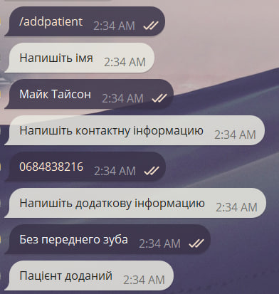
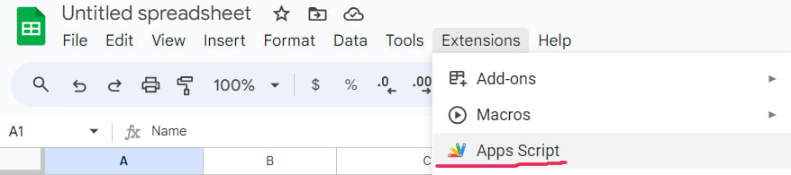
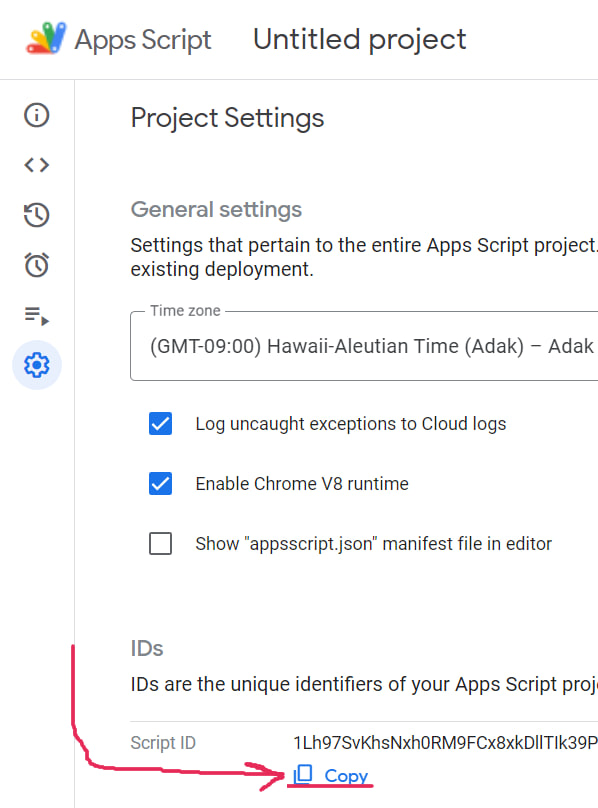

# MedCardsBot
A Telegram bot for managing medical cards 

`Dont look to the code-quality, writed by GPT 🤡`

# Functional:
```
/addpatient - Додати нового пацієнта
/findallpatients - Знайти всіх пацієнтів
/deletepatient - Видалити пацієнта
/addwork - Додати виконану роботу
/findwork - Знайти виконану роботу за іменем пацієнта
/findworkbydate - Знайти виконану роботу за датою
/deleteworkbydate - Видалити виконану роботу за датою
/deleteworkbyname - Видалити виконану роботу за іменем пацієнта
/schedulework - Запланувати роботу
/findschedulework - Знайти заплановану роботу за іменем пацієнта
/findscheduleworkbydate - Знайти заплановану роботу за датою
/deletescheduleworkbydate - Видалити заплановану роботу за датою
/deletescheduleworkbyname - Видалити заплановану роботу за іменем пацієнта
/updatepatientadditionalinfo - Змiнити додаткову iнформацiю пацiента
/updatepatientcontactinfo - Змiнити контактну iнформацiю пацiента
```
### Example:


# Installing
1. Clone `Repo`
> git clone https://github.com/xXdatelXx/MedCardsBot.git
2. Put your [Bot Token](https://www.siteguarding.com/en/how-to-get-telegram-bot-api-token) into [Script](MedCardsBot/src/Message.js)
3. Create new [Sheet](https://workspace.google.com/products/sheets/)
4. In `Sheet` page: Extensions -> AppsScript -> ProjectSettings -> Copy `Script ID`





5. Install [clasp](https://github.com/google/clasp) in directory with `Repo`
> npm install -g @google/clasp
6. Login clasp with `Script ID`
> clasp login
7. Push files to `Sheet`
> clasp push
8. In `Sheet` page: MedCards -> Create Sheets
9. Deploy project and copy `Web App URL`


10. Set webhook
> api.telegram.org/bot`YOUR-BOT-TOKEN`/setWebhook?url=`YOUR-WEB-APP-URL`
